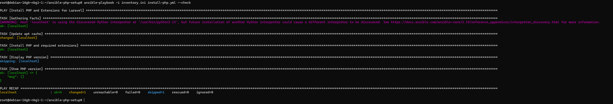

# Ansible Samples

A collection of Ansible examples and configurations for learning and reference.

## Structure

- **basics/** - Fundamental concepts (YAML, INI syntax, etc.)
- **samples/** - Practical examples (web servers, installations, configurations)

## Purpose

This repository documents my learning journey with Ansible and serves as a reference for common DevOps tasks.

## Install PHP Sample
